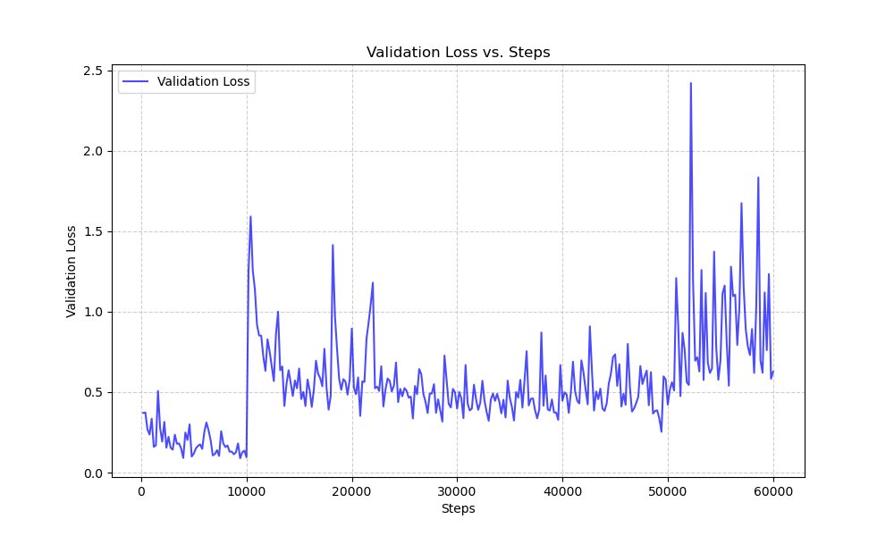
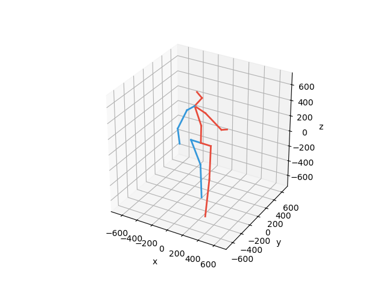
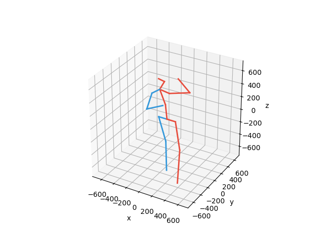

# On human motion prediction using recurrent neural networks

2 criteria on performance of motion modeling:

1. Short term prediction, measured quantitatively (MSE loss in angle space)
   -: not practical for tracking due to clear discontinuities in the first prediction
2. Longer time horizons measured qualitatively, to generate feasible motion
   -: non-deterministic, cannot measured quantitatively
   -: current algorithms strives to achieve long-term plausible motion, suffer from occasional unrealistic artifacts (foot sliding)

**this paper focuses on short-term prediction**
Two main contributions:
1. To deal with the known problem of failing to recover from their own mistakes if fed only ground-truth during training gin RNNs. **Introduces realistic error in training time without any scheduling by feeding the predictions of the net as it is done in test time.**
2. Still unable to accurately represent the conditioning poses in its hidden representation, resulting in discontinuity in the first frame of the prediction. **Creates a residual architecture that models first order motion derivatives.**

## Previous related woks

1. LSTM-3LR and ERD: gradually add noise to the input during training
   -: noise scheduling is hard to tune
2. SRNN

## Problems and solutions

1. First frame discontinuity: jumps between conditioning ground truth and first predicted frame

Used sequence-to-sequence (encoder + decoder) architecture to address short term prediction
Added residual connection between the input and the output of each RNN cell, thus the velocity helps fix the motion continuity (residual)

2. In order to improve robustness of the model, previous work added noise as part of input, hard to tune, invalid validation error, hurts short term prediction

During training, let decoder produce a sequence by always taking its own samples as input (sampling-based loss)

## Architecture

Either the residual addtion or the sampling based loss is closely related to the implementation of the architecture.

1. Encoder phase

```python
for i in range(self.source_seq_len - 1):
    state = self.cell(encoder_inputs[i], state)
    state = F.dropout(state, self.dropout, training=self.training)
```

Sequence of absolute joint angles are fed into the GRU. The GRU updates its hidden state at each timestep based on the current input and the previous hidden state. (dropout is a regularization preventing over-fitting)
The final hidden state serves as a summary of the input sequence, capturing patterns and relationships in the data.

2. Decoder phase

```python
for i, inp in enumerate(decoder_inputs):
      if loop_function is not None and prev is not None:
          inp = loop_function(prev, i)
      inp = inp.detach()
      state = self.cell(inp, state)
      output = inp + self.fc1(F.dropout(state, self.dropout, training=self.training))
      outputs.append(output.view([1, batchsize, self.input_size]))
      if loop_function is not None:
        prev = output
```

During the decoder phase, the sampling-based loss is implemented by updating inp based on the loop function. If loop_function is not None, then inp is updated with the previous output of the decoder itself (inp is the groundtruth of previous frame otherwise).
The Residual addition is implemented in line

```python
output = inp + self.fc1(F.dropout(state, self.dropout, training=self.training))
```

in which `inp` is the absolute joint angle of previous frame. By adding the fully connected layer to the previous absolute joint angle, the fully connected layer is trained to learn to extract the velocity from the hidden state, since the loss function is defined as `step_loss = (preds - decoder_outputs)**2` in the training step.

## Results

Below are the results of running model with residual and multiple actions, model with residual and single action, and model only with the sampling-based loss with 10000 iterations.


The result shows that the model with residual and multiple actions indeed reaches the best quantitative result, while from the gif we see that it doesn't really generate plausible long-term motion predictions.
The note in the github repository also points out that the model with sampling-based loss produces the realistic long-term motion with loss computed over 1 second.
This also corresponds to the statement in the paper that trying to address both problems at once is very challenging, especially in the absence of a proper quantitative evaluation for long-term plausibility.

| milliseconds | 80 | 160 | 320 | 400 | 560 | 1000 |
|--------------|----|-----|-----|-----|-----|------|
walking_Residual_MA          | 0.382 | 0.648 | 0.861 | 0.952 |   n/a |   n/a |
walking_Residual_SA          | 0.396 | 0.652 | 0.832 | 0.893 |   n/a |   n/a |
walking_Sampling             | 0.369 | 0.620 | 0.845 | 0.931 | 1.068 | 1.241 |
eating_Residual_MA           | __0.260__ | __0.444__ | __0.681__ | __0.842__ |   n/a |   n/a |
eating_Residual_SA           | 0.274 | 0.464 | 0.740 | 0.918 |   n/a |   n/a |
eating_Sampling              | 0.297 | 0.504 | 0.776 | 0.946 | 1.164 | 1.487 |


<div style="text-align: center;">
  <div style="display: inline-block; margin-right: 5px; text-align: center;">
    
    <p>Walking - Residual MA</p>
  </div>
  <div style="display: inline-block; margin-right: 5px; text-align: center;">
    
    <p>Walking - Residual SA</p>
  </div>
  <div style="display: inline-block; text-align: center;">
    
    <p>Walking - Sampling</p>
  </div>
</div>

<div style="text-align: center; margin-top: 20px;">
  <div style="display: inline-block; margin-right: 5px; text-align: center;">
    
    <p>Eating - Residual MA</p>
  </div>
  <div style="display: inline-block; margin-right: 5px; text-align: center;">
    
    <p>Eating - Residual SA</p>
  </div>
  <div style="display: inline-block; text-align: center;">
    
    <p>Eating - Sampling</p>
  </div>
</div>


## Why couldn't the residual model generate plausible long predictions?

From the code we see that, for models with residual, the loss for 560ns and 1000ns are n/a only because they are not displayed (seq_length_out is default to 10):
```python, translate.py
for ms in [1,3,7,9,13,24]:
  if args.seq_length_out >= ms+1:
    print(" {0:.3f} |".format( mean_mean_errors[ms] ), end="")
  else:
    print("   n/a |", end="")
```

During training, the loss computation is the same for either sapling-based model or residual model:

```python
preds = model(encoder_inputs, decoder_inputs)
step_loss = (preds-decoder_outputs)**2
step_loss = step_loss.mean()

step_loss.backward()
optimiser.step()
```

This means that the residual model **is** trained based on the loss for longer time-step. Then why only the sampling-based model produces more realistic and plausible predictions for longer time steps?

One guess is that the residual model is modeling the first derivative instead of modeling the poses directly, but the loss is calculated based on the pose instead of velocity, so the mistake in the prediction of velocity cannot be well fixed by the loss function.
